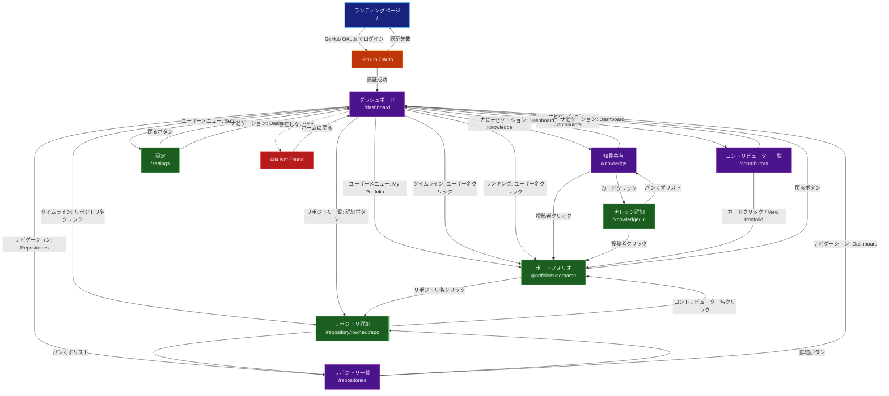
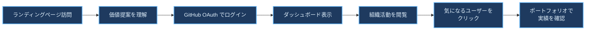
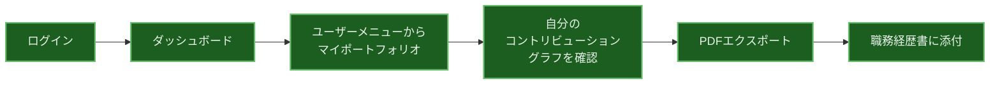
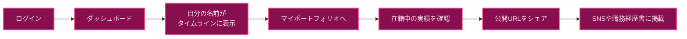
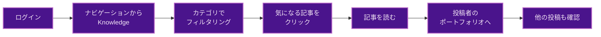
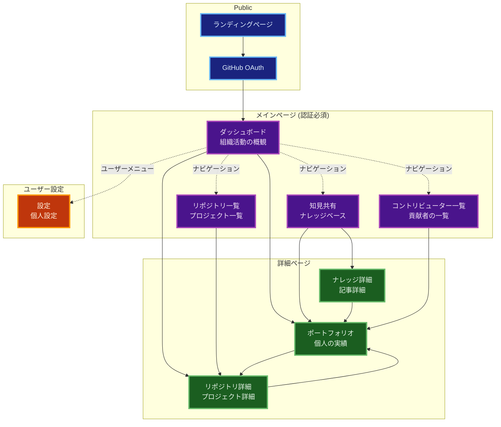
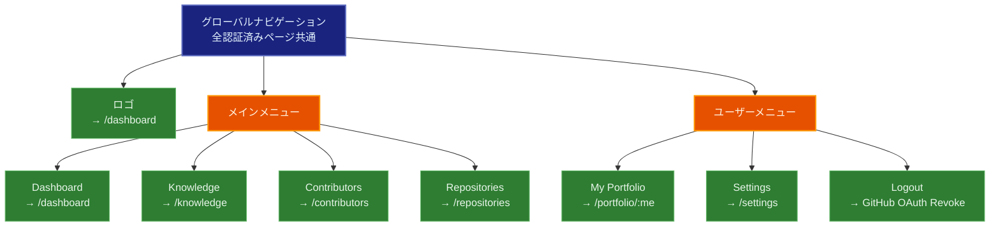
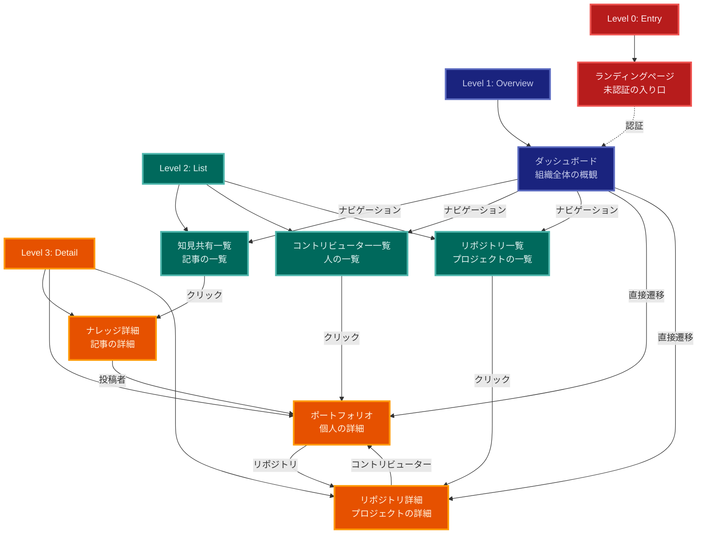
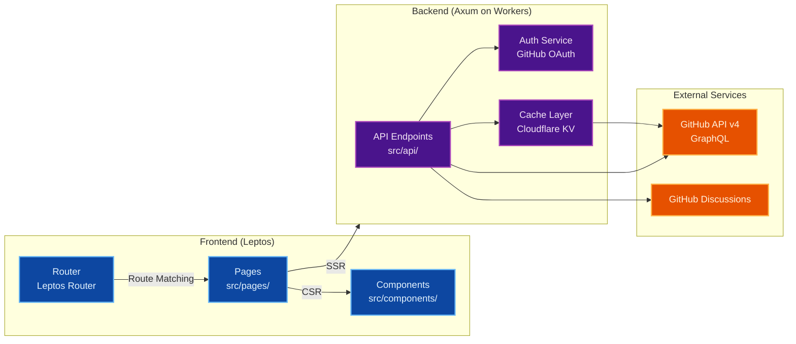

# 画面遷移図 (Screen Flow Diagram)

**作成日:** 2025-11-21  
**関連ドキュメント:** 20251121_screen-design-proposal.md, PRD.md  
**スタイル:** ダークモード準拠

## Mermaid形式の画面遷移図

> **Note:** 全てのダイアグラムはダークモード準拠のカラースキームを使用しています。各ノードはダークな背景色と明るいストローク、読みやすいテキストカラーで表示されます。

### 全体フロー

---

## ユーザージャーニー別フロー

### 1. 初回訪問ユーザーのジャーニー

### 2. 現役社員のジャーニー (自分の実績確認)

### 3. マネージャーのジャーニー (組織活動の把握)

### 4. 元社員/外部コントリビューターのジャーニー

### 5. 知見探索のジャーニー

---

## ページ間の関係性マップ

---

## 情報アーキテクチャ (IA)

```mermaid
graph TD
    Root[Continuum]
    
    Root --> Public[Public Area<br/>未認証]
    Root --> Private[Private Area<br/>認証済み]
    
    Public --> Landing["/ - ランディングページ"]
    Public --> AuthError["/auth/error - 認証エラー"]
    
    Private --> Dashboard["/dashboard - ダッシュボード"]
    Private --> KnowledgeArea[Knowledge - 知見共有]
    Private --> PeopleArea[People - 人]
    Private --> ProjectArea[Projects - プロジェクト]
    Private --> UserArea[User - ユーザー]
    
    KnowledgeArea --> KnowledgeList["/knowledge - 一覧"]
    KnowledgeArea --> KnowledgeItem["/knowledge/:id - 詳細"]
    
    PeopleArea --> ContributorsList["/contributors - 一覧"]
    PeopleArea --> PortfolioPage["/portfolio/:username - ポートフォリオ"]
    
    ProjectArea --> RepositoriesList["/repositories - 一覧"]
    ProjectArea --> RepositoryPage["/repository/:owner/:repo - 詳細"]
    
    UserArea --> SettingsPage["/settings - 設定"]
    
    Root --> ErrorPages[Error Pages]
    ErrorPages --> NotFoundPage["/404 - Not Found"]
    ErrorPages --> MaintenancePage["/maintenance - メンテナンス"]
    
    classDef rootStyle fill:#880e4f,stroke:#f06292,stroke-width:4px,font-weight:bold,color:#fce4ec
    classDef areaStyle fill:#1a237e,stroke:#5c6bc0,stroke-width:3px,font-weight:bold,color:#c5cae9
    classDef pageStyle fill:#2e7d32,stroke:#66bb6a,stroke-width:2px,color:#c8e6c9
    
    class Root rootStyle
    class Public,Private,KnowledgeArea,PeopleArea,ProjectArea,UserArea,ErrorPages areaStyle
    class Landing,AuthError,Dashboard,KnowledgeList,KnowledgeItem,ContributorsList,PortfolioPage,RepositoriesList,RepositoryPage,SettingsPage,NotFoundPage,MaintenancePage pageStyle
```

---

## ナビゲーション構造

---

## 画面の階層構造

---

## 実装時の技術マッピング

---

## まとめ

本ドキュメントでは、Continuumアプリケーションの画面遷移を以下の視点から図示しました：

1. **全体フロー:** すべての画面の遷移関係
2. **ユーザージャーニー別フロー:** 各利用者タイプの代表的な使い方
3. **ページ間の関係性マップ:** 画面のグルーピングと関係性
4. **情報アーキテクチャ (IA):** URL構造と階層
5. **ナビゲーション構造:** グローバルナビゲーションの構成
6. **画面の階層構造:** 画面の深さレベル
7. **実装時の技術マッピング:** フロントエンド/バックエンド/外部サービスの関係

これらの図を参考に、効率的かつ一貫性のある画面実装を進めることができます。

